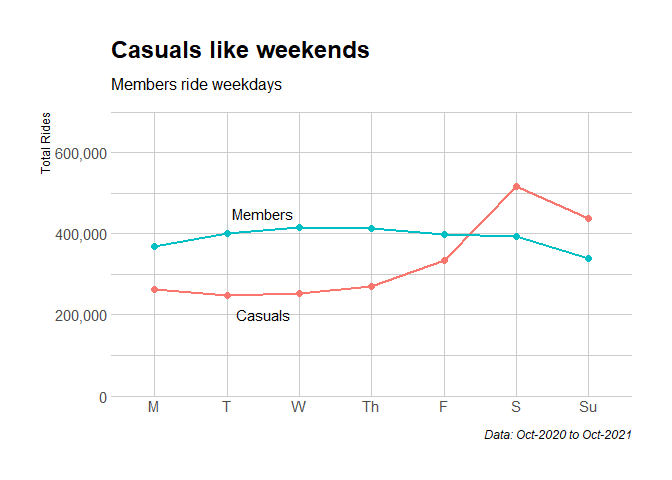
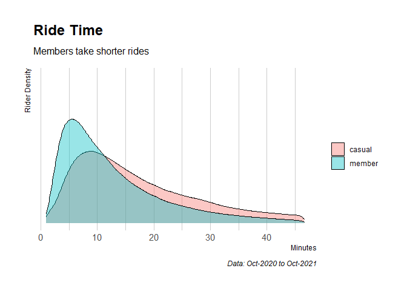
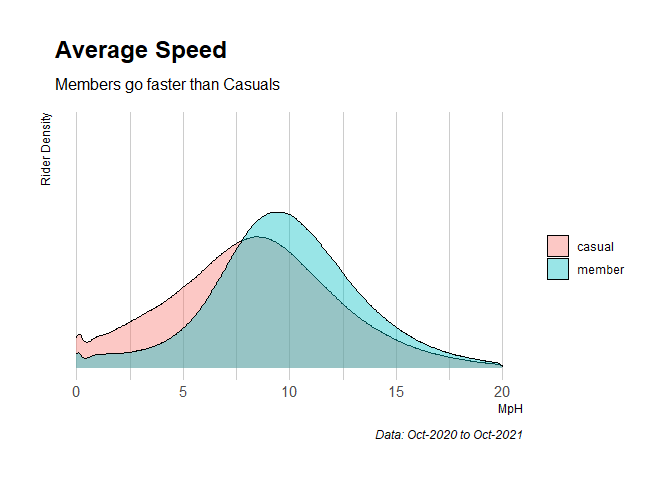
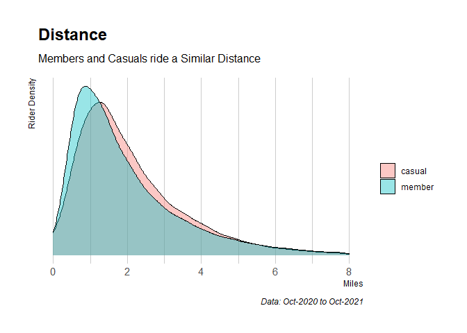
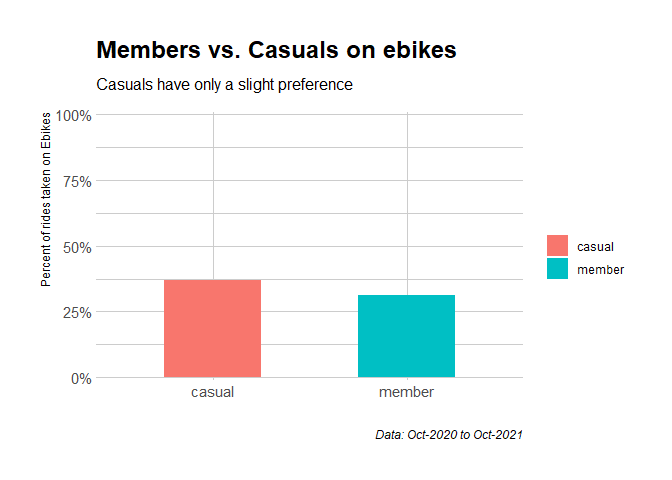
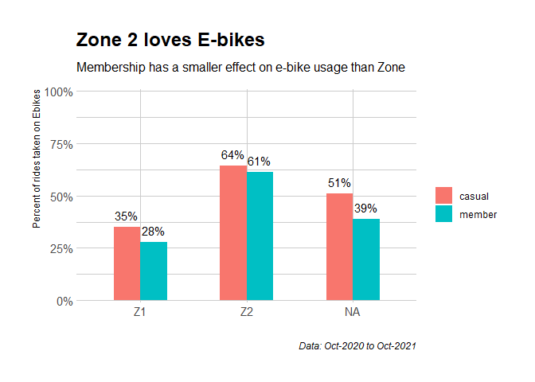

bikeshare-report
================
Karl Nagy
01/24/2021

## Packages Used

The following were used when in R

    ## package 'tidyverse' successfully unpacked and MD5 sums checked
    ## 
    ## The downloaded binary packages are in
    ##  C:\Users\Karl\AppData\Local\Temp\RtmpSea48b\downloaded_packages

    ## package 'ggmap' successfully unpacked and MD5 sums checked
    ## 
    ## The downloaded binary packages are in
    ##  C:\Users\Karl\AppData\Local\Temp\RtmpSea48b\downloaded_packages

    ## package 'pwr' successfully unpacked and MD5 sums checked
    ## 
    ## The downloaded binary packages are in
    ##  C:\Users\Karl\AppData\Local\Temp\RtmpSea48b\downloaded_packages

    ## package 'hrbrthemes' successfully unpacked and MD5 sums checked
    ## 
    ## The downloaded binary packages are in
    ##  C:\Users\Karl\AppData\Local\Temp\RtmpSea48b\downloaded_packages

    ## package 'googledrive' successfully unpacked and MD5 sums checked
    ## 
    ## The downloaded binary packages are in
    ##  C:\Users\Karl\AppData\Local\Temp\RtmpSea48b\downloaded_packages

# Key Questions

-   What differentiates annual members and casual riders?
-   How can casual riders be converted to annual members to drive future
    growth?

# Summary

Casuals and members differ in several ways \* members ride during
weekdays more than casuals \* member riding behavior is less seasonal
than casuals \* members and casuals bike similar distances \* members
ride faster than casuals

These differences in behavior have implications for a marketing campaign
attempting to convert casuals to members. The guiding philosophy of such
a campaign will be to identify member-like behavior in casuals, and
appeal to them for membership.

# Data Sources and Security

Historical bikeshare use dataset obtained from *Divvy*, a Chicago-based
company [Data Source
Here](https://divvy-tripdata.s3.amazonaws.com/index.html) Google cloud
used for storage of all files

# Data Cleaning and Manipulation

Initial cleaning and manipulation was done in BigQuery SQL editor, then
transferred to R.

## BigQuery SQL Data Cleaning

### Added

-   `day_of_week` column created from `started_at`, with integers 1-7
    corresponding to Sunday-Saturday

### Changed

-   2020.10 and 2020.11 tables use integer values for `start_station_id`
    and `end_station_id` columns, changed to string values to match the
    other tables

### Fixed

-   removed rows where `started_at` occurred after `ended_at`, which
    caused duplicate rows

End product: bikeshare_v4.csv

## Data Cleaning and Wrangling in R

### bikeshare_v5

-   Added: `ride_length` column created from `ended_at` - `started_at`
    columns

### bikeshare_v6

-   Changed: replaced NA values of start and end station names and IDs
    with “undocked”

### bikeshare_v7

-   Changed: `rideable_type` instances of “docked bike” to
    “classic_bike”

### bikeshare_v8

-   Changed: converted `ride_length` to a `lubridate` duration object
    for easier reading

### bikeshare_v9

-   Added: created `ride_length_min`, ride_length expressed in minutes
    as a numeric datatype
-   Changed: `ride_length` to `ride_length_dur` for clarity

### bikeshare_v10

-   Fixed: removed outlier rows with a `ride_length_dur` longer than
    1440 minutes(1 day) or shorter than 30 seconds

### bikeshare_v11

-   Added: `area` column, with “Hyde_Park”, “Evanston”, “Z1”, and “Z2”
    “noncluster” categories by setting boundaries of
    `start_lat' and`start_lng\` values, based on
    [this](https://account.divvybikes.com/map) and interpreted below

                    Z1:  start_lat > 41.822978 & start_lat < 42.0219536 & start_lng > -87.690118 & start_lng < -87.593127

                    Z2_nocollege:   start_lat > 41.643837 & start_lat < 42.0219536 & start_lng > -87.836541 & start_lng < -87.524491 & isFALSE(start_lat > 41.77 & start_lat < 41.82 & start_lng > -87.61 & start_lng < -87.56)

                    Hyde Park: start_lat > 41.77 & start_lat < 41.82 & start_lng > -87.61 & start_lng < -87.56

                    Evanston:  start_lat > 42.0219536 & start_lat < 42.07 & start_lng > -87.69 & start_lng < -87.65

### bikeshare_v12

-   Removed: “noncluster” examined and found to be 44 rows outside of
    Zone 2

### bikeshare_v13

-   Fixed: removed rows less than 1 minute, in keeping with Divvy’s
    policy on their data

### bikeshare_v14

-   Added: calculated the Manhattan distance between start and end
    lat-lng data columns, stored in miles as `ride_ml`
-   Added: calculated average speed of ride from `ride_length_min` and
    `ride_ml`, stored in mph as `speed_mph`

### bikeshare_v15

-   Changed: `area` column parameters altered to distinguish Evanston
    from Northwestern University

                   Z1: start_lat > 41.822978 & start_lat < 42.0219536 & start_lng > -87.690118 & start_lng < -87.593127

                   Hyde_Park: start_lat > 41.77 & start_lat < 41.82 & start_lng > -87.61 & start_lng < -87.56

                   Z2_nocollege: start_lat > 41.643837 & start_lat < 42.0219536 & start_lng > -87.836541 & start_lng < -87.524491

                   E_NWU: start_lat > 42.044047 & start_lng > -87.684714 & start_lat < 42.07 & start_lng < -87.65

                   E_nocollege: start_lat > 42.0219536

    The E_nocollege includes a section that technically is part of Z1, a
    2x4 block section just south of Cavalry Catholic Cemetery

### bikeshare_v16

\*Fixed: readjusted Hyde_Park boundaries to specific streets

-   `Hyde_Park` - E. 63rd St. in the South - (41.780428 lat) - S. Martin
    Luther King Dr. in the West - (-87.615707 lng) - E. Hyde Park Blvd
    in the North - (41.802297 lat) - S. Stony Is Ave. in the East -
    (-87.586710 lng)

-   `Ev_NW_College` - Bordered by Lake St. in the South - (42.044047
    lat) - Maple Ave. in the West - (-87.684714 lng)

-   `Ev_nocollege` - Bordered by W. Howard St. in the South -
    (42.0219536 lat) - excluding the `Ev_NW_College` area

-   `Z1` - Bordered by W. Pershing Rd in the South - (41.822978 lat) - N
    Western Ave. in the West - (-87.690118 lng) - W Howard St. in the
    North - (42.0219536 lat) - these borders omit a small chunk of the
    north of `Z1`, assigning it instead to `Ev_nocollege`

-   `Z2_nocollege` - Out to Indiana state line in the East - (-87.524491
    lng) - W Howard St. in the North - (42.0219536 lat) - excludes `Z1`
    and `Hyde_Park`

### bikeshare_v17

-   Removed: `ride_length_dur`, unnecessary

### Weekday Bike Use

<!-- -->

Members use bikes more during the weekday than casuals, who prefer the
weekend. This is likely due to members using the bikes for work/school,
and casuals for pleasure. The trend is especially prominent in the
Hyde_park cluster around the university campus, where students have
reason not only for home-work-home transit, but multiple short trips
from class to class, nearby restaurants, and study locations. It is
worth mentioning that without individual data to confirm how many trips
per person are taken per day or more detailed individual information to
confirm a lifestyle pattern, this hypothesis can only go so far.

### Seasonal Bike Use

<!-- -->

Chicago winters are harsh, and total rides across both members and
casuals show this; Rides decrease outside of temperate months and
increase when weather is pleasant. Anecdotal observation of recorded
temperatures show that total rides drop harshly when the maximum
temperature reaches freezing or below, likely the bitter cold makes
biking less attractive. During Jan. 26 - Feb. 15 for example, Chicago
had a record 34 in. of snow, which corresponds to the lowest point of
ride density.

Though both members and casuals are affected by the seasons, members
have less of a ride increase than casuals in temperate months, and less
of a ride decrease in colder months. This year-round level behavior
taken with the weekday use pattern seems to suggest a clear theme:
members ride for function, casuals ride for pleasure, and bike riding as
a whole is seasonal.

### Distance, speed, and ride time

<!-- --><!-- --><!-- -->

Members and Casuals tend to cover a similar distance, though Members
tend to shorten their ride by going faster than Casuals.

Considering that bikes compete with walking, electric scooters, public
transportation, and automobile use, longer or shorter distances probably
see potential riders consider using an alternative means of transport
instead. The sweet spot for Divvy biking distance seems to be within the
0.75-1.5 mile range.

### Rideable type use

<!-- --><!-- -->

E-bike vs. classic bike use is not about the absolute cost, but the
relative cost of using the other mode of transport. Consider the example
the cost of a six minute e-bike ride in each zone, with the bike being
returned to a dock, for a member or a casual, contrasted with the
classic bike alternative cost:

Z1/Casual: 3.30 + 1.20 = 4.50 classic alternative = 3.30

Z1/Member: none + 0.90 = 0.90 classic alternative = 0.00

Z2/Casual: 3.30 + none = 3.30 classic alternative = 3.30

Z2/Member: none + none = 0.00 classic alternative = 0.00

Z2 riders have no cost difference between an electric or classic bike,
and so use the higher end option of e-bikes more frequently. Z1 riders
may decide to take a bike ride, and having locked in that decision now
consider cost, find e-bikes too expensive, and take a classic bike
instead.

Z1 members receive a strong discount on e-bike use when compared with Z1
casuals, but still use e-bikes less. This could be that members take
more bike rides per-week, and thus the yearly cost of e-bike use for an
individual is higher for members than casuals, and so reduced member use
of e-bikes makes sense. For verification of this hypothesis, more
specific data is needed.

People who rent e-bikes seem to ride further than those who do not, but
ride time is a much smaller factor on e-bike use than the relative cost
of e-bike vs. classic.

## Frequent Riders

Membership is a bulk ride discount. In theory, people who ride the most
would benefit the most from membership from a savings standpoint.
Without individualized data however, no supporting quantitative evidence
for this theory can be found. Regardless, the underlying logic is so
fundamental that it merits discussion.

Casuals who pass the breakeven point for ride savings of more than two
30-minute rides per month stand to save money from a membership,
assuming they keep this behavior up throughout the year. Not purchasing
a membership when they could save money may indicate a reluctance to
commit to a lifestyle, therefore strategies to appeal to this group
should make investment in a biking lifestyle more attractive.

## Limitations/Further information needs

### Individual rider data

Since membership is a flat yearly fee for rides below a certain
duration, its main pitch to casuals is that of bulk discount: more rides
for less money. Even without individual data, this alone means casuals
who ride multiple days per week, or multiple times per day are prime
targets for advertising. Being able to compare individuals would allow
the “members have a commute” hypothesis to be tested.

Other information about individuals like occupation, age, residence,
yearly earnings, and transportation mode habits could be used to better
profile customer segments and identify patterns and needs. One of the
key issues for converting casuals to members is knowing if a casual is a
resident who could use a membership, or an out-of-towner who would not
buy a membership, no matter their casual use patterns. Separating
resident casuals from nonresident casuals would be key in any targeted
marketing effort, and without individualized data this cannot be done.

### Individual bike data

Ebikes may be so popular that their actual use is limited by the number
of them in circulation. With individual bicycle data, the uptime per
bike could be found, and a better sense of e-bike popularity established
beyond current data. Knowing other information like locked vs. docked
e-bike use could help identify whether docking availability may act as a
confounding variable. Without this crucial information, no conclusion
can be made as to member/casual e-bike preference.

## Recommendations

The goal is to convert Casual riders to Members. With this in mind, an
ideal ad campaign would find casuals with member-like behaviors and
appeal to them. Here are four primary behavior types to look for in
casuals, and strategies for each:

### 1) Weekday riders

-   Offer a free week of membership to foster a lifestyle switch

### 2) Fast riders

-   Highlight rides as a fast, self-paced commute alternative
-   Contrast with other transport as being greener, traffic-free, and
    self-controlled

### 3) Warm season riders

-   Offer limited-time deals on an annual membership in the
    June-September window, when casuals see the best ride weather
    quality
-   Highlight good weather in ads

### 4) Frequent riders

-   Offer free e-bike usage for a certain number of miles biked as part
    of a member rewards program to induce commitment
